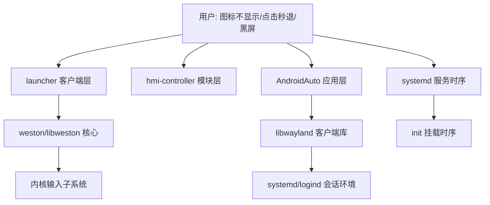

# AndroidAuto 集成期多故障排查：ivi-shell 图标缺失 / weston 崩溃 / 应用秒退 / 开机黑屏 / 触摸失灵

> 场景：x9m_ms（Semidrive kunlun，Weston 13 定制 ivi-shell）上集成自研
> wayland 客户端 AndroidAuto（launcher 图标 → 点击启动 → 右上角关闭）。
> 排查时间：2026-09-15 ~ 09-16。设备时钟无 RTC，每次开机回到 2024-02-27 17:33，
> 文中日志时间戳仅表示单次 boot 内的相对顺序。

---

## 1. 故障现象

**主报错 1（weston 启动即崩，出现 3 次）**
```
Feb 27 18:09:53 x9mms weston[338321]: weston: /usr/src/debug/weston/13.0.0/ivi-shell/hmi-controller.c:1517: ivi_hmi_controller_add_launchers: Assertion `layout_surface' failed.
systemd[1]: weston.service: Main process exited, code=killed, status=6/ABRT
```

**主报错 2（点击图标后 app 立即退出，无任何窗口）**
```
# stderr（launcher fork 出的 app）：
wayland: wl_display_connect failed (XDG_RUNTIME_DIR/WAYLAND_DISPLAY?)
# 修好连接后又出现：
listener function for opcode 5 of wl_pointer is NULL
```

**主报错 3（整机 reboot 后黑屏，weston 起不来）**
```
Feb 27 17:33:10 x9mms sh[816]: /bin/sh: /data/ivi-setup.sh: No such file or directory
systemd[1]: weston.service: Control process exited, code=exited, status=127/n/a
```

**伴生现象**

| # | 现象 | 是否与主问题同源 |
|---|---|---|
| 1 | launcher 上第 5 个图标（icon-id=4007）不显示 | 部分同源（icon 路径大小写），见 4.1 |
| 2 | 触摸屏完全无反应（✕ 点不动、workspace 滑不动） | **否**（独立根因：内核无触摸驱动），是最大干扰项 |
| 3 | weston 日志被 `sd,rpmsg-ipcc: msg (190->190) received with no recipient` 每秒多条刷屏，启动段日志全被冲掉 | 否，是现象 2 的伴生噪音 |
| 4 | 手动 `adb shell` 跑 app 一切正常，launcher 点击启动才秒退 | 与主报错 2 同源（环境差异） |
| 5 | 设备 reboot 后 ivi 环境整个丢失（回到 desktop-shell） | 独立问题（bind-mount 非持久），已由 systemd drop-in 解决 |

**复现条件**
- 报错 1：`/data/weston.ini` 中任一 `[ivi-launcher]` 的 `icon=` 指向不存在的文件 + 重启 weston → 100% 崩溃
- 报错 2：由 launcher 点击启动 app（weston spawn 链）→ 100% 秒退；`adb shell` 直接启动 → 不复现
- 报错 3：整机 reboot → 必现（systemd 启动 weston 早于 init 脚本挂载 /data 约 1 秒）
- 触摸：任何时刻（本套内核上恒定，非间歇性）

**不复现条件（排除项）**
- 同一 png 换成有效路径（`/data/icon_ivi_video.png`）后 4007 图标正常显示 → png 内容本身无问题
- `wayland-info` 确认 `ivi_application`/`ivi_hmi_controller` 全局接口存在 → ivi-shell 加载正常
- launcher 客户端 `WAYLAND_DEBUG=1` 抓包：`ivi_application@6.surface_create(4007 ...)` 正常发出、`UI_ready()` 正常发出 → 客户端解析与创建逻辑无问题
- weston 崩溃后手动 `systemctl start weston` 可正常启动（配置正确时）→ weston 二进制本身无问题

## 2. 排查思路



核心方法：上层报错文案不可信；**adb 手动跑正常 vs launcher 启动失败**是最重要的分叉证据——沿着"两条启动路径的差异"（环境变量）逐层剥。多个同时出现的异常（图标/触摸/崩溃）先按**无关**处理分别归因，最后再合并结论。

## 3. 逐层排查过程与证据

### 3.1 weston ABRT（hmi-controller 层）

| 实验 | 结果 | 结论 |
|---|---|---|
| `journalctl _COMM=weston --no-pager \| tail` | `hmi-controller.c:1517: Assertion 'layout_surface' failed.` | 崩在 add_launchers 的 `assert(get_surface_from_id(icon-id))` |
| 比对 weston.ini 与实际文件 | ini 写 `icon=/data/AndroidAuto/res/icons/AndroidAuto.png`，`ls` 实际为 `androidauto.png` | **大小写不匹配，文件不存在** |
| `sed` 改小写后 `systemctl restart weston` | active，图标显示 | 根因命中 |
| `WAYLAND_DEBUG=1` 重启 launcher 客户端抓协议 | `surface_create(4001..4007)` 全部发出，随后 `UI_ready()` | 客户端对坏路径**跳过创建但照常 UI_ready**，hmi-controller 不容错直接 assert |

本层结论：**命中**。两个互相配合的缺陷：客户端 icon 加载失败不报错跳过 + 服务端 assert 不可容错。修法：设备上补大写副本 `AndroidAuto.png`（两种写法都命中）。

### 3.2 app 秒退第一层（libwayland 连接）

| 实验 | 结果 | 结论 |
|---|---|---|
| `adb shell` 设 `XDG_RUNTIME_DIR=/run` 启动 | APP_ALIVE | app 代码本身正常 |
| 读 weston 进程环境模拟启动 | `wl_display_connect failed` | 复现！weston 环境 `XDG_RUNTIME_DIR=/run/user/1000` 且无 `WAYLAND_DISPLAY` |
| 修回退（`XDG_RUNTIME_DIR=/run`）部署后用 **launcher 进程真实环境**模拟 | 仍失败 | **之前模拟错了对象**——要用 launcher（weston spawn 的客户端）的 environ，不是 weston 的 |
| `cat /proc/<launcher_pid>/environ` | `WAYLAND_DISPLAY=wayland-1`、`WAYLAND_SOCKET=38` | 真凶两个变量（见 4.2） |

本层结论：**命中**。修复为四级连接回退链（清 `WAYLAND_SOCKET` → `XDG_RUNTIME_DIR=/run` → 显式 `wayland-0`），用 launcher 真实环境复验通过（surface 3010 创建 + configure 480x325）。

### 3.3 app 秒退第二层（listener 回调）

| 实验 | 结果 | 结论 |
|---|---|---|
| 连接修好后 launcher 环境启动 | `listener function for opcode 5 of wl_pointer is NULL` 后 APP_DEAD | opcode 5 = pointer frame 事件，libwayland 对 NULL 回调**直接 abort** |
| 对照 sysroot 头文件 `wayland-client-protocol.h` | `axis_discrete`/`axis_value120` 为 4 参数（**无 time**），与记忆中的上游签名不同 | 签名必须以 SDK 头文件为准，编译器把关 |

本层结论：**命中**。补齐 9 个 no-op thunk（pointer 的 axis/frame/axis_source/axis_stop/axis_discrete/axis_value120/axis_relative_direction + touch 的 shape/orientation）。launcher 环境复验：存活、归层、configure 正常。

### 3.4 开机黑屏（systemd/挂载时序）

| 实验 | 结果 | 结论 |
|---|---|---|
| `journalctl -u weston`（开机时段） | `ivi-setup.sh: No such file or directory`，status=127 | ExecStartPre 失败 → weston unit 失败 |
| `systemctl status data.mount` | `Loaded: loaded (/proc/self/mountinfo)`，`Active: since 17:33:11`（weston 17:33:10 启动） | **/data 是 init 脚本挂载、mountinfo 被动导入**，挂载比 weston 晚 1s |
| drop-in 加 `RequiresMountsFor=/data` 后 reboot | 仍然黑屏 | 被动导入的 mount 单元**不参与**依赖排序，该方案无效（排除项） |
| 改为 ExecStartPre 等待循环（最多 30s 等 `/data/ivi-setup.sh` 出现）后 reboot | `17:33:10 Starting → 17:33:13 Started` | 3 秒内自动就绪，修复生效 |

本层结论：**命中**。

### 3.5 触摸失灵（内核层，未修复）

| 实验 | 结果 | 结论 |
|---|---|---|
| `ls /dev/input/` | 空 | 系统级零输入设备 |
| weston journal | `warning: no input devices found, but none required as per configuration.` | 印证（且 `require-input=false` 是配置者留的佐证） |
| `dmesg \| grep rpmsg` | `msg (190->190) received with no recipient` 持续刷屏 | MCU 触摸服务**在发数据**，Linux 侧无人收 |
| `zcat /proc/config.gz \| grep TOUCHSCREEN` | `# CONFIG_TOUCHSCREEN_SEMIDRIVE is not set`、GOODIX/UINPUT 均 not set | **内核未编触摸驱动，用户态注入路线也堵死** |
| `dtc -I dtb -O dts /sys/firmware/fdt` 反编译 | gt9271/sdrv gt9xx/safetouch 节点齐全 | 设备树无辜，纯内核配置问题 |
| 插 USB 鼠标 | libinput 识别 `USB OPTICAL MOUSE`，event0 | 绕行方案可用 |

本层结论：**命中但无法本层修复**（需带 `CONFIG_TOUCHSCREEN_SEMIDRIVE=y` 的内核，属 BSP 范畴）。**触摸"从刷机起就不可用"，并非本次集成引入的回归**。

### 3.6 干扰项与误判记录

| 误判 | 实际 | 教训 |
|---|---|---|
| `find /proc/device-tree -maxdepth 2 -iname "*touch*"` 无结果 → 判断"设备树无触摸节点" | 节点在 depth 4（`/soc/i2c@.../touch@5d`） | find 加了 maxdepth 就不再是"确认存在性"的手段 |
| BusyBox `ps`/`pgrep` 找不到 launcher 进程 → 怀疑客户端死了 | comm 截断 15 字符 + 只显示 tty 进程 | 用 `/proc/[0-9]*/cmdline` 扫描 |
| 日志文件无新条目 → 以为 app 没启动 | `/tmp` 是 tmpfs，reboot 清掉了证据；且设备时钟每次 boot 重叠 | 日志写 `/data`；用 `uptime` 判断记录归属 |
| 模拟 launcher 用 weston 进程的 environ | launcher 是独立进程，有自己的 `WAYLAND_SOCKET=38` | 复现环境必须取**实际 spawn 者的** environ |
| 怀疑图标被排到 workspace 第二页（hmi-controller 网格） | 大小写修复后图标正常显示在第一页 | 排除项成立但当时无法验证（触摸死、滑不动） |

## 4. 完整因果链

**4.1 weston ABRT（图标缺失 → 整个合成器崩溃）**
```
[根因: weston.ini icon 路径大小写与实际文件不符（AndroidAuto.png ≠ androidauto.png）]
        ↓
[launcher 客户端 png 加载失败，静默跳过创建该图标 surface]
        ↓
[客户端照常发送 ivi_hmi_controller.UI_ready]
        ↓
[定制 hmi-controller add_launchers: assert(get_surface_from_id(4007)) 失败]
        ↓
[weston 进程 ABRT → 黑屏，所有应用陪葬]
```

**4.2 app 秒退（两个 bug 叠加，修一个暴露下一个）**
```
[根因A: weston spawn 客户端后 fork+exec，环境带 WAYLAND_SOCKET=已关闭的fd、
        WAYLAND_DISPLAY=wayland-1（实际 socket 为 /run/wayland-0）]
        ↓
[libwayland 对无效 WAYLAND_SOCKET 直接失败不回退]
        ↓
[app wl_display_connect 返回 NULL → setup 失败退出（第一层秒退）]
        ↓ 修复后
[根因B: pointer listener 的 frame 等事件回调为 NULL]
        ↓
[鼠标一动 weston 发 frame 事件 → libwayland abort（第二层秒退）]
```

**4.3 开机黑屏**
```
[根因: /data 由 init 脚本挂载，晚于 systemd 启动 weston]
        ↓
[weston.service ExecStartPre 引用 /data/ivi-setup.sh → 127]
        ↓
[weston unit 失败；开屏动画已被上一条 ExecStartPre 停掉 → 整屏黑]
```

**4.4 触摸（独立链，非回归）**
```
[根因: 内核未编 SEMIDRIVE 触摸驱动]
        ↓
[/dev/input 为空，weston no input devices]
        ↓
[MCU 侧触摸数据持续从 rpmsg 190 端口上报，无人接收（dmesg 刷屏）]
        ↓
[✕ 点击、workspace 滑动、图标点击全部无反应（鼠标可用后恢复交互）]
```

## 5. 各层状态总结

| # | 层 | 状态 | 验证手段 |
|---|---|---|---|
| 1 | AndroidAuto 应用（MVC/渲染/输入处理） | ✅ 正常 | `adb shell` 启动 + launcher 真实环境复验：`ivi surface id=3010` → `configure 480x325` → 存活 |
| 2 | launcher 客户端（定制 weston-ivi-shell-user-interface） | ⚠️ 有缺陷但可用 | `WAYLAND_DEBUG=1` 抓包：icon 加载失败会静默跳过（不报错） |
| 3 | hmi-controller 模块（定制） | ⚠️ 有缺陷但可用 | assert 崩溃原文 + 定位 `hmi-controller.c:1517`；icon surface 缺失即整机崩 |
| 4 | weston 13 核心 | ✅ 正常 | `wayland-info`：`ivi_application`/`ivi_hmi_controller` 全局接口存在 |
| 5 | systemd 服务链（动画停止+bind-mount+weston） | ✅ 已修复 | reboot 实测 `17:33:10 Starting → 17:33:13 Started` |
| 6 | libwayland 客户端行为（环境变量/NULL abort） | ✅ 已适配 | 四级回退链 + 全事件 no-op，launcher 环境复验通过 |
| 7 | 内核输入子系统（触摸驱动） | ❌ **缺驱动** | `zcat /proc/config.gz \| grep TOUCHSCREEN` → `SEMIDRIVE is not set`；`/dev/input` 为空 |
| 8 | 硬件/MCU 触摸服务 | ✅ 正常（在发数据） | dmesg rpmsg 190 端口持续报点 |
| 9 | 设备树 | ✅ 正常 | `dtc` 反编译：gt9271/safetouch 节点齐全 |

## 6. 结论与行动

**根因汇总**（5 个独立问题，4 个已闭环）：
1. weston ABRT：icon 路径大小写错误 + 定制 hmi-controller `assert` 不可容错
2. app 秒退：launcher spawn 链的 `WAYLAND_SOCKET`/`WAYLAND_DISPLAY` 环境污染 + listener NULL abort
3. 开机黑屏：/data 挂载晚于 weston 启动（RequiresMountsFor 对被动导入 mount 无效）
4. reboot 丢 ivi 环境：bind-mount 非持久 → systemd drop-in 自动化
5. 触摸失灵：内核 `CONFIG_TOUCHSCREEN_SEMIDRIVE is not set`（**未解决**）

**需要谁做什么（给 BSP/固件团队）**：
- 现象：任何 wayland 客户端无法收到触摸输入；`/dev/input` 为空
- 证据：`zcat /proc/config.gz | grep TOUCHSCREEN`（SEMIDRIVE/GOODIX/UINPUT 全 not set）；
  `dmesg | grep 'no recipient'`（MCU 触摸服务在 rpmsg 190 端口持续发数据）；
  `dtc -I dtb -O dts /sys/firmware/fdt | grep -i touch`（设备树节点齐全）
- 期望行为：内核编入 `CONFIG_TOUCHSCREEN_SEMIDRIVE=y`（或对应 sdrv gt9xx/safetouch 驱动）+ `CONFIG_INPUT_UINPUT=y` 备用
- 实际行为：无输入设备；触摸数据无人接收
- 顺带反馈：定制 hmi-controller `add_launchers` 的 `assert(layout_surface)` 建议
  改为跳过并 `weston_log` —— 目前一个失效的 ini 图标路径即可打崩整个合成器

**当前可用绕行方案**：
- 触摸 → **USB 鼠标**（`CONFIG_USB_HID=y` 热插拔即用），代价：无多点触控；适用：全部开发调试
- weston 崩溃 → 图标双名称副本（`AndroidAuto.png` + `androidauto.png`）+ 改 ini 前先 `ls` 确认

## 7. 方法论沉淀

- **被 spawn 出来的进程，复现环境必须取 spawn 者的实际 environ，不能想当然用更上层进程的**
  本次表现：用 weston 的 environ 模拟 launcher 启动失败后仍秒退，误判修复无效
  下次遇到怎么用：`cat /proc/<真实父进程>/environ` + `env -i $(...) cmd` 精确复现

- **libwayland 的 WAYLAND_SOCKET 无效 fd 是硬失败，不回退到路径连接**
  本次表现：launcher fork+exec 后 CLOEXEC 关掉了 fd，app 对失效的 38 直接失败
  下次遇到怎么用：嵌入式 weston 客户端连接统一做"清 WAYLAND_SOCKET → 修 XDG_RUNTIME_DIR → 显式 socket 名"回退链

- **wayland listener 结构体必须全事件非 NULL——libwayland 对 NULL 回调直接 abort**
  本次表现：鼠标一动来 pointer frame 事件（opcode 5）即死
  下次遇到怎么用：不处理的事件填 no-op thunk；且**签名以目标 SDK 头文件为准**
  （本例 wayland 1.22 的 axis_discrete/axis_value120 与上游不同，无 time 参数）

- **配置文件路径错误在容错差的系统里是"核弹"：先验证文件存在再重启服务**
  本次表现：ini 里 icon 大小写错一个字母 → weston 整机 ABRT
  下次遇到怎么用：改任何 ini 路径后 `ls` 一遍；对 hmi-controller 这类 assert 型代码，
  崩溃时第一时间 `journalctl _COMM=weston` 拿 assert 原文（assert 行号=直接供认）

- **BusyBox 环境的进程/日志工具结论不可信，/proc 是唯一可靠源**
  本次表现：ps 看不见 launcher（comm 截断+只列 tty 进程）、pgrep 长 pattern 警告、head -N 语法不同
  下次遇到怎么用：查进程扫 `/proc/[0-9]*/cmdline`；查日志用 `journalctl _COMM=xxx`（注意 comm 截断）

- **持久化排障日志，别放 tmpfs；无 RTC 的设备日志时间戳会跨 boot 重叠**
  本次表现：/tmp 日志被 reboot 清掉，秒退证据丢失；17:38 的记录可能是上一个 boot 的
  下次遇到怎么用：日志写 /data；判断记录归属用 `uptime`/boot 起点，别信时间戳

- **dmesg 环形缓冲会被高频噪音刷爆，关键启动日志要第一时间抓**
  本次表现：rpmsg "no recipient" 每秒多条，把触摸驱动 probe 段日志全冲掉
  下次遇到怎么用：复现后立即 dump dmesg；或 `dmesg -n 1` 先降噪再复现

- **多个同时出现的异常先按无关处理，分别归因后再合并**
  本次表现：图标不显示 + 触摸无反应 + 后续崩溃，实为 4 个独立根因；把"触摸死"并入
  图标问题会完全走偏（幸好触摸链路独立排查到了内核层）
  下次遇到怎么用：每个异常单独找自己的证据链，同源性最后再判断

---

### 附：关键修复清单（对应 git 提交）

| 修复 | 位置 | 提交 |
|---|---|---|
| 连接四级回退链 + 9 个 no-op listener | `src/wayland/WlClient.{h,cpp}` | `a768436` |
| XDG_RUNTIME_DIR=/run 回退（后被四级链覆盖） | `src/wayland/WlClient.cpp` | `2f61be5` |
| 日志 /tmp → /data 持久化 | `config/androidauto.ini` | `2f61be5` |
| weston.service drop-in（停动画 + 等 /data + bind-mount） | 设备 `/etc/systemd/system/weston.service.d/ivi.conf` | 设备侧配置 |
| 图标双名称副本（大小写防坑） | 设备 `/data/AndroidAuto/res/icons/` | 设备侧配置 |
