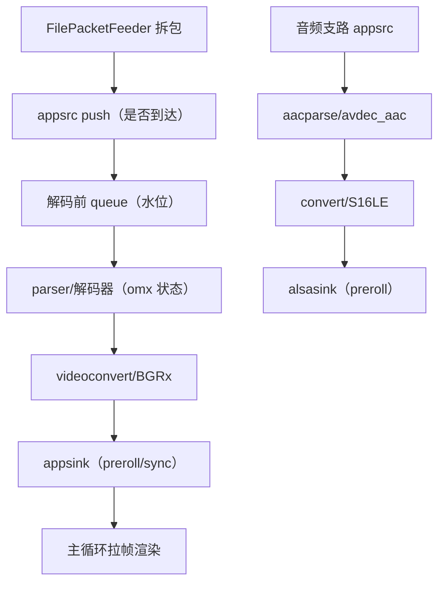

# 统一媒体管线（appsrc 动态分支）整链不出帧、不出声的连环排查

> 项目：AndroidAuto（x9m_ms / Weston 13 ivi-shell / GStreamer 1.22）
> 背景：按 screencast-avsync-design.md 重构为"单管线 + appsrc 裸流输入 +
> 音视频 bin 动态挂拆"架构后，文件源经 FilePacketFeeder（filesrc+parsebin
> 拆包）喂包，视频画面与音频均无输出。

## 1. 故障现象

**主报错（无报错，全静默卡死）**

```
[media:video] session started
[media:audio] session started
（此后无 first frame / 无 [latency] / ALSA 不打开）
[diag] pushed v=120 a=92 pkts | v_queue 100000000us/9956B a_queue 0us/0B
[diag] pushed v=240 a=186 pkts | v_queue 100000000us/9956B a_queue 0us/0B
（v/a 包持续推入；v_queue 恒顶满 100ms；a_queue 恒 0）
```

特征：**无任何 ERROR/WARNING**，omx 解码器日志显示已到 Executing 状态，
但收不到输入；视频 queue 水位恒满、音频 queue 水位恒 0（音频侧被 alsasink
反压挡在更上游）。

**伴生现象**

| # | 现象 | 是否与主问题同源 |
|---|---|---|
| 1 | 同文件同链路用 gst-launch（filesrc 直连）完全正常 | 否（对照组，定位关键） |
| 2 | feeder 首版 fakesink sync=FALSE 时整文件瞬间灌入，PTS 跳一轮 | 否（独立 bug，见 3.1） |
| 3 | 卡顿检测在启动期误触发 IDR 恢复，丢 224 包 + base_ts 重置 | 部分（连锁放大器） |
| 4 | 循环 seek 后第二轮无数据（parsebin+FLUSH seek 已知坑） | 否（独立 bug） |
| 5 | drift 日志显示 video/audio 位置差 -10s 且持续拉大 | 是（主问题的另一种观测面） |

**复现条件**：appsrc(is-live=TRUE) + 动态挂载 bin（sync_state_with_parent）
+ 需 preroll 的 sink（appsink sync=TRUE / alsasink）——三者组合必现。
**不复现条件**：gst-launch filesrc 直连同链路（非 live 源）；appsrc
is-live=FALSE 时立即恢复正常。

## 2. 排查思路



核心方法：链路上每层只回答"输入正常吗？输出正常吗？"——用 **diag 定时器
（包计数 + 两级 queue 水位）** 定位第一个"输入正常输出断"的层，再用
**gst-launch 对照组**隔离"链路本身"与"app 组合方式"的差异。

判断前提：上层表现（"不播"）不指明根因；omx 日志说 Executing 也不代表
数据真的进了解码器——要看 buffer 是否流动。

## 3. 逐层排查过程与证据

### 3.1 Feeder 层（拆包与节奏）

| 实验 | 结果 | 结论 |
|---|---|---|
| fakesink sync=FALSE（首版） | `[feeder] loop: pts offset +16050ms` 启动后 1 秒内即打——整文件瞬间读完 | 命中①：无 sync 的 fakesink 让拆包全速跑，PTS 越过管线时钟一整轮，播放全乱 |
| fakesink 改 sync=TRUE | 拆包按文件 PTS 1x 重放，`pushed v=60/s` 节奏正确 | 修复①。文件源必须有"实时到达节奏"，等价投屏包 |

### 3.2 appsrc/queue 层（数据是否进入管线）

| 实验 | 结果 | 结论 |
|---|---|---|
| diag 定时器（每 2s 打包计数+水位） | v 包恒 +120/2s 推入成功；v_queue 恒 100000000us 顶满；a_queue 恒 0 | push 正常；堵点在 v_queue **下游**；音频被更下游反压挡住 |
| pad probe（q-out/dec-in/sink-in 三点） | 三个 probe 各只打 `buffer #0` 后静止 | 数据只流过约 1 帧就停——**解码器之后的 sink 在等东西** |
| GST_DEBUG=omx*:4 | omx Loaded→Idle→Executing 全部成功完成 | 解码器组件本身健康，排除 VPU/驱动问题 |

**本层结论**：数据到达 appsrc 且推入 queue，解码器就绪，但下游 sink
停止拉取——问题在 sink 的等待行为，不在数据面。

### 3.3 Sink 层（preroll 与时钟）——命中

| 实验 | 结果 | 结论 |
|---|---|---|
| appsink sync=TRUE→FALSE | 仍卡（同现象） | appsink 自身 sync 不是根因（但确实要 FALSE，见 3.4） |
| gst-launch 对照：filesrc!qtdemux!queue!h265parse!omxh265dec!videoconvert!BGRx!fakesink + 音频支 queue!alsasink | **完全正常 PLAYING**，ALSA 出声 | 链路本身无问题；差异只剩输入源类型（filesrc vs appsrc） |
| 对照组微调实验：qtdemux 音频 pad 直连 fakesink（无 queue） | 卡 PREROLLING | **排除项也踩坑**：demux 的 pad 必须接 queue 再接 sink，否则干扰判断 |
| appsrc is-live=TRUE→FALSE | **立即恢复**：首帧解码+上屏 395ms，ALSA S16_LE/2ch/48000 打开 | **命中根因**：live 源在 PAUSED 不推数据，与动态 bin 的 preroll 依赖形成死锁 |

**本层结论**：命中。机制——`appsrc is-live=TRUE` 在 PAUSED 状态不产生
数据；而动态挂载的 bin（sync_state_with_parent 到 PLAYING 中的管线）必须
收到首帧完成 preroll 才进 PLAYING；PLAYING 又是 live 源开始推数据的前提。
三条边互为前提，死锁。

### 3.4 连锁问题层（主根因修复后暴露）

| 实验 | 结果 | 结论 |
|---|---|---|
| 启动期观察 | stall 误触发（解码器追帧期 queue 瞬时顶满）→ IDR 恢复丢 224 包 + base_ts 重置 → 音频 PTS 错位 → alsasink 等待未来时刻 → 二次卡死 | 命中②：卡顿检测（§4.2）是投屏网络机制，文件源无 IDR 请求通道，误触发会摧毁时间线——加 `stall_detect` 开关，文件源禁用 |
| EOS 循环 seek 回 0 | seek 返回成功但 parsebin 第二轮不再产流 | 命中③：parsebin+FLUSH seek 不可靠——循环改为 EOS 时整管线重建（ptsOffset 累加保 PTS 单调），毫秒级开销 |
| 时延统计总结 | `pull->commit avg -40382.8ms` 负数 | 命中④：frame callback 未回来时新帧覆盖 pendingLat_，配账串帧——pending 期间不更新 |

## 4. 完整因果链

```
[根因: appsrc is-live=TRUE 与动态 bin 的 preroll 死锁]
        ↓
[live 源在 PAUSED 不推数据；bin 等 sink preroll 才转 PLAYING；
 PLAYING 又是 live 源推数据的前提]
        ↓
[v_queue 顶满 → appsrc block 反压 → feeder 停在 push 上]
        ↓
[无 ERROR 无 WARNING 的全静默卡死；音频被 alsasink 同机制反压]
```

连锁（主根因修复后依次暴露）：

| 路径 | 表现 | 原因 |
|---|---|---|
| 文件源 + stall_detect 开 | 启动即丢包、时间线重置、二次卡死 | 追帧期 queue 顶满被误判为网络卡顿，IDR 恢复机制误触发 |
| 文件源 + 循环 seek | 第二轮无数据 | parsebin 对 FLUSH seek 支持不可靠 |
| feeder 无 sync | 1 秒读完 16s 文件，PTS 越一轮 | fakesink sync=FALSE 使拆包脱离实时节奏 |

## 5. 各层状态总结

| # | 层 | 状态 | 验证手段 |
|---|---|---|---|
| 1 | FilePacketFeeder 拆包 | ✅ 正常 | diag：pushed v=60/s（1x 节奏） |
| 2 | appsrc 数据面 | ✅ 正常（is-live=FALSE 后） | diag 包计数持续增长；probe 有数据 |
| 3 | 解码前 queue | ✅ 正常 | diag：稳态水位 0（消费及时） |
| 4 | omxh265dec VPU 硬解 | ✅ 正常 | 日志无 fallback；线程 `v_dec:src` 存在；进程 maps 含 libgstomx.so |
| 5 | videoconvert→BGRx→appsink | ✅ 正常 | `first frame decoded (1920x960)`；[latency] 持续输出 |
| 6 | aacparse→avdec_aac→alsasink | ✅ 正常 | `/proc/asound/card1/pcm0p/sub0/hw_params` = S16_LE/2ch/48000 |
| 7 | 音画同步 | ✅ 正常 | `[drift] ... diff=+7.5ms (in sync)`（纠偏收敛） |
| 8 | 循环播放 | ✅ 正常（重建方案） | `loop: restart (pts offset +16050ms)` 多轮持续 |

## 6. 结论与行动

**根因**：`appsrc` 的 `is-live=TRUE`（live 语义：PAUSED 不推数据）与动态
挂载 bin 的 preroll 依赖（sink 收到首帧才 PLAYING）互为前提，形成状态机
死锁，整链静默无输出。

**需要谁做什么**：纯应用侧问题，无需上游动作。（关联的上游事项沿用前次
结论：AAC 软解插件经 /opt/x9hp 提供，start.sh 已接；hmi-controller bind
权限待厂商放行。）

**当前可用方案**：
1. `is-live=FALSE`——数据节奏由 feeder 的 `fakesink sync=TRUE` 1x 重放
   控制（等价投屏包实时到达），不需要 appsrc 自身 live 时钟语义。
   代价：投屏真接网络包时需重新评估（到达节奏天然实时，预计无影响，
   **待验证**）。
2. `stall_detect=0`（文件源）——卡顿检测+IDR 恢复是投屏网络机制，文件源
   无 IDR 请求通道，禁用。代价：无（文件源不存在网络卡顿）。
3. 循环 = EOS 整管线重建 + ptsOffset 累加。代价：每轮 ~400ms 首帧间隔
   （可接受；播放中无感）。

## 7. 方法论沉淀

- **静默卡死时先找"最后一个还在动的点"**
  本次表现：无 ERROR 无 WARNING。
  下次怎么用：静态日志全无异常时，上定时器打**各缓冲区水位 + 包计数**
  （diag tick），第一个"输入涨、输出停"的层就是断点；再上 pad probe 确认
  数据流到哪个 pad 停下。

- **同链路必须留一个 gst-launch 对照组**
  本次表现：app 里卡死的链路，gst-launch 直连完全正常。
  下次怎么用：把"链路元素本身"与"程序的组装方式"隔离——对照组通过
  则问题在组合方式（线程/状态/时钟/属性差异），不要去怀疑元素。

- **live 源与动态管线是危险的组合**
  本次表现：is-live=TRUE + sync_state_with_parent 互锁。
  下次怎么用：凡是"边跑边挂拆分支"的设计，推数据的一侧**不要**用 live
  语义控制节奏；节奏控制交给数据到达端（feeder sync / 网络包天然实时）。

- **对照组本身要先排坑，否则会误导**
  本次表现：gst-launch 里 qtdemux 的音频 pad 直连 fakesink（无 queue）
  导致对照组也"假卡死"，一度误判链路有问题。
  下次怎么用：demux 出来的 pad 与 sink 之间永远加 queue；对照组异常时
  先怀疑对照组自己的写法。

- **自动恢复机制要问"误触发时毁掉什么"**
  本次表现：卡顿检测在解码器追帧期误触发，IDR 恢复重置 base_ts，把音画
  时间线彻底搞乱——比不恢复更糟。
  下次怎么用：任何"检测→恢复"机制必须有使能条件（本场景：有无 IDR 请求
  通道），且确认窗口要长于已知的正常瞬时抖动（追帧顶满 2s 内）。

- **文件源的哨兵值要用标志位，不能用魔数**
  本次表现：baseTs==0 判断"未初始化"，但文件首包 PTS 恰好是 0，第二包
  覆盖基准。
  下次怎么用：与输入值域可能重叠的哨兵一律改成显式 bool 标志。

- **多 bug 连发时按"主根因先修，连锁逐个收"推进**
  本次表现：主死锁修完后依次暴露 stall 误触发、循环 seek、统计串帧三个
  独立问题，各自独立定位修复。
  下次怎么用：主断点打通前不要分心修伴生异常；打通后伴生异常会自己
  排队现身，逐个按 1-6 节流程快查快修。
