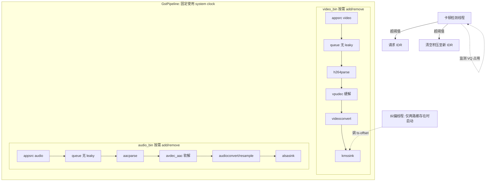

# 车载无线投屏 GStreamer 音画同步接收架构设计

## 1. 背景与目标

投屏协议侧（USB / 近场热点 WiFi，蓝牙仅用于连接协商）以裸流形式分别下发 H.264 / AAC 数据包，本端负责解包、解码、渲染，并保证音画同步。目标：

- 视频硬解（VPU 插件），音频软解（AAC）。
- 音频、视频均可能单独存在（纯视频投屏、纯音频镜像），也可能同时存在；音频流并非连接建立就一直有数据，未播放时为空，播放时才开始发送。
- 不做任意丢帧；卡顿恢复通过请求 IDR 帧实现。
- 不同传输方式（USB / WiFi 热点）延迟特征差异大，架构参数需可配置，不需要为每种传输写不同的 pipeline 分支。

## 2. 总体架构



video_bin / audio_bin 各自是独立 `GstBin`，随协议层的会话事件动态挂载 / 拆除，互不依赖；pipeline 本身及其时钟在两路会话存在与否的切换过程中保持不变，避免运行时切换时钟基准带来的卡顿。

## 3. 时间戳与时钟策略

### 3.1 基准时间戳

投屏协议侧时间戳为单调时钟，音视频共用同一时钟域。以**第一个到达的媒体包**（不论音频还是视频）建立基准：

```c
static guint64 base_ts = 0;  // 全局唯一，首次收到任意一路数据包时确定

void on_media_packet(uint64_t capture_ts_ns, GstBuffer *buf) {
    if (base_ts == 0) base_ts = capture_ts_ns;
    GST_BUFFER_PTS(buf) = capture_ts_ns - base_ts;
}
```

音频流是"播放时才发送"，意味着音频的第一包很可能晚于视频第一包很久才到达——这不影响架构，只要减的是同一个 `base_ts`，晚到的音频包换算出的 PTS 依然落在正确的相对位置上，`kmssink` / `alsasink` 各自按自己的 PTS 对齐 pipeline clock 即可，不需要因为"音频后到"做特殊处理。

`base_ts` 只在下文 3.3 节描述的 IDR 恢复流程中会被重置，正常运行期间不重置。

### 3.2 appsrc 配置

```c
g_object_set(appsrc, "format", GST_FORMAT_TIME,
    "is-live", TRUE, "do-timestamp", FALSE,
    "stream-type", GST_APP_STREAM_TYPE_STREAM,
    "block", TRUE, NULL);   // queue 满时阻塞 push，而不是丢
```

### 3.3 Pipeline 时钟

固定使用 `GstSystemClock`，不随音视频哪路存在/消失而切换：

```c
gst_pipeline_use_clock(GST_PIPELINE(pipeline), gst_system_clock_obtain());
```

单路存在时，同步完全由该路 sink 的 `sync=TRUE` 默认行为完成（按 PTS 相对 pipeline clock 该等等、该丢晚到的丢），不需要额外的"是否要同步"判断逻辑。

## 4. 数据面：不丢帧 + 卡顿时按 GOP 边界整体清空

### 4.1 queue 配置

```c
g_object_set(queue,
    "max-size-time", profile->pre_decode_queue_max_ns,  // 见第 6 节，按传输方式配置
    "max-size-buffers", 0,
    "max-size-bytes", 0,
    "leaky", 0,   // GST_QUEUE_NO_LEAK
    NULL);
```

queue 顶满后 appsrc push 阻塞，网络抖动在 `max-size-time` 以内被吸收，不丢任何编码包。

### 4.2 卡顿检测与 IDR 恢复

```c
typedef struct {
    GstElement *queue_v;
    guint64 threshold_ns;      // 见第 6 节
    gboolean waiting_for_idr;
} StallMonitor;

// 定时轮询（如每 200ms）
void check_stall(StallMonitor *mon) {
    guint64 level_ns;
    g_object_get(mon->queue_v, "current-level-time", &level_ns, NULL);
    if (!mon->waiting_for_idr && level_ns > mon->threshold_ns) {
        request_idr_from_phone();      // 走投屏协议控制通道
        mon->waiting_for_idr = TRUE;
    }
}

// 网络线程收到每个 H.264 NAL 时调用
void on_h264_nal(StallMonitor *mon, uint8_t nal_type, uint8_t *data, size_t size) {
    gboolean is_idr = (nal_type == 5);
    if (mon->waiting_for_idr) {
        if (!is_idr) return;   // 新 IDR 到达前的旧 GOP 数据直接丢弃，不进 appsrc
        gst_element_send_event(mon->queue_v, gst_event_new_flush_start());
        gst_element_send_event(mon->queue_v, gst_event_new_flush_stop(TRUE));
        base_ts = 0;            // 重新建立时间基准起点
        mon->waiting_for_idr = FALSE;
    }
    push_to_appsrc(data, size);
}
```

对比常见的 leaky-queue 丢帧方案：这里丢的是**已经判定为无意义的整段旧 GOP**，而不是随机丢参考帧，因此不会出现花屏；来电界面之类的持续性状态画面，只会有一次可控的短暂跳变，不会因为丢帧而"永久消失"。

## 5. 动态分支管理：音频 / 视频可独立出现或消失

```c
GstElement *video_bin = NULL;   // 非 NULL 表示当前视频路存在
GstElement *audio_bin = NULL;   // 非 NULL 表示当前音频路存在

void on_video_session_start(TransportType transport) { /* 见第 6 节 */ }
void on_video_session_stop(void) {
    if (!video_bin) return;
    gst_element_set_state(video_bin, GST_STATE_NULL);
    gst_bin_remove(GST_BIN(pipeline), video_bin);
    video_bin = NULL;
    update_drift_monitor();
}
// on_audio_session_start / on_audio_session_stop 结构对称
// 音频"播放时才发送"对应的就是 on_audio_session_start 被调用的时刻，
// 不需要在连接建立时就预先创建 audio_bin
```

三种存在状态下的行为：

| 场景 | Pipeline 结构 | 纠偏 loop |
|---|---|---|
| 只有视频 | 仅 video_bin | 不启动 |
| 只有音频 | 仅 audio_bin | 不启动 |
| 音视频都有 | video_bin + audio_bin | 启动 |

```c
void update_drift_monitor(void) {
    if (video_bin && audio_bin) start_drift_correction_loop();
    else stop_drift_correction_loop();
}
```

## 6. 传输方式差异化参数

蓝牙仅用于连接协商，实际媒体流走近场热点（WiFi），因此不存在"蓝牙传输 profile"，只需要区分 USB 与 WiFi 两档：

```c
typedef enum { TRANSPORT_USB, TRANSPORT_WIFI } TransportType;

typedef struct {
    guint64 pre_decode_queue_max_ns;
    guint64 stall_threshold_ns;
} TransportProfile;

static const TransportProfile PROFILE_TABLE[] = {
    [TRANSPORT_USB]  = { .pre_decode_queue_max_ns = 100 * GST_MSECOND,
                          .stall_threshold_ns     = 60  * GST_MSECOND },
    [TRANSPORT_WIFI] = { .pre_decode_queue_max_ns = 500 * GST_MSECOND,
                          .stall_threshold_ns     = 300 * GST_MSECOND },
};
```

会话建立时按协议层给出的连接类型套用对应 profile：

```c
void on_video_session_start(TransportType transport) {
    video_bin = make_video_bin();
    const TransportProfile *p = &PROFILE_TABLE[transport];
    GstElement *queue = gst_bin_get_by_name(GST_BIN(video_bin), "video_queue");
    g_object_set(queue, "max-size-time", p->pre_decode_queue_max_ns, NULL);
    current_stall_threshold_ns = p->stall_threshold_ns;
    gst_bin_add(GST_BIN(pipeline), video_bin);
    gst_element_sync_state_with_parent(video_bin);
    update_drift_monitor();
}
```

表中数值为行业常见量级方向，非实测结果，落地前需按第 8 节方式实测校准。

## 7. 音画纠偏（仅两路并存时）

```c
// 周期性（如每 2 秒）执行一次小步长调整，避免跳变
gint64 current_offset;
g_object_get(kmssink, "ts-offset", &current_offset, NULL);
gint64 step = CLAMP(measured_drift_ns / 10, -5 * GST_MSECOND, 5 * GST_MSECOND);
g_object_set(kmssink, "ts-offset", current_offset + step, NULL);
```

- 优先调整视频侧 `ts-offset`，不调整音频，避免音频丢采样/插采样带来的爆音或卡顿感。
- `measured_drift_ns` 通过对比视频当前渲染 PTS 与音频侧已播放到的 PTS 得出。
- 长时间运行下的漂移来自手机端与车机音频硬件两个独立晶振，量级通常在分钟级累积到几十毫秒，纠偏 loop 只需低频运行。

## 8. 待确认事项

| 序号 | 问题 | 影响 |
|---|---|---|
| 1 | 投屏协议是否有明确的"音频/视频会话开始/结束"事件，还是只能靠数据包超时推断 | 决定第 5 节 `on_*_session_start/stop` 能否精确触发，超时推断法容易把短暂卡顿误判为会话结束 |
| 2 | `vpudec` 插件输出是否为 DMA-BUF，能否零拷贝进 `kmssink` | 决定 `videoconvert` 这一步能否省略 |
| 3 | `request_idr_from_phone()` 的具体控制通道、及请求后手机端出下一个 IDR 的实际延迟 | 决定第 6 节 `stall_threshold_ns` 怎么定，定太紧会频繁触发不必要的 IDR 请求 |
| 4 | `video_appsrc` 的 `block=TRUE` 阻塞是否会拖慢网络接收线程上的其他消息（音频、触控事件等），取决于是否共用同一线程/socket | 决定是否需要把网络读取拆成独立线程，避免反压串扰 |
| 5 | 视频会话中途消失后又恢复时，协议是否会主动带一个 IDR | 决定 `on_video_session_start` 恢复时是否需要主动调用一次 `request_idr_from_phone()` |
| 6 | 第 6 节表中延迟量级为经验估计，非实测 | 落地前需拿实际链路统计网络包到达间隔的 P99 等分布，回填 `pre_decode_queue_max_ns` / `stall_threshold_ns` |
